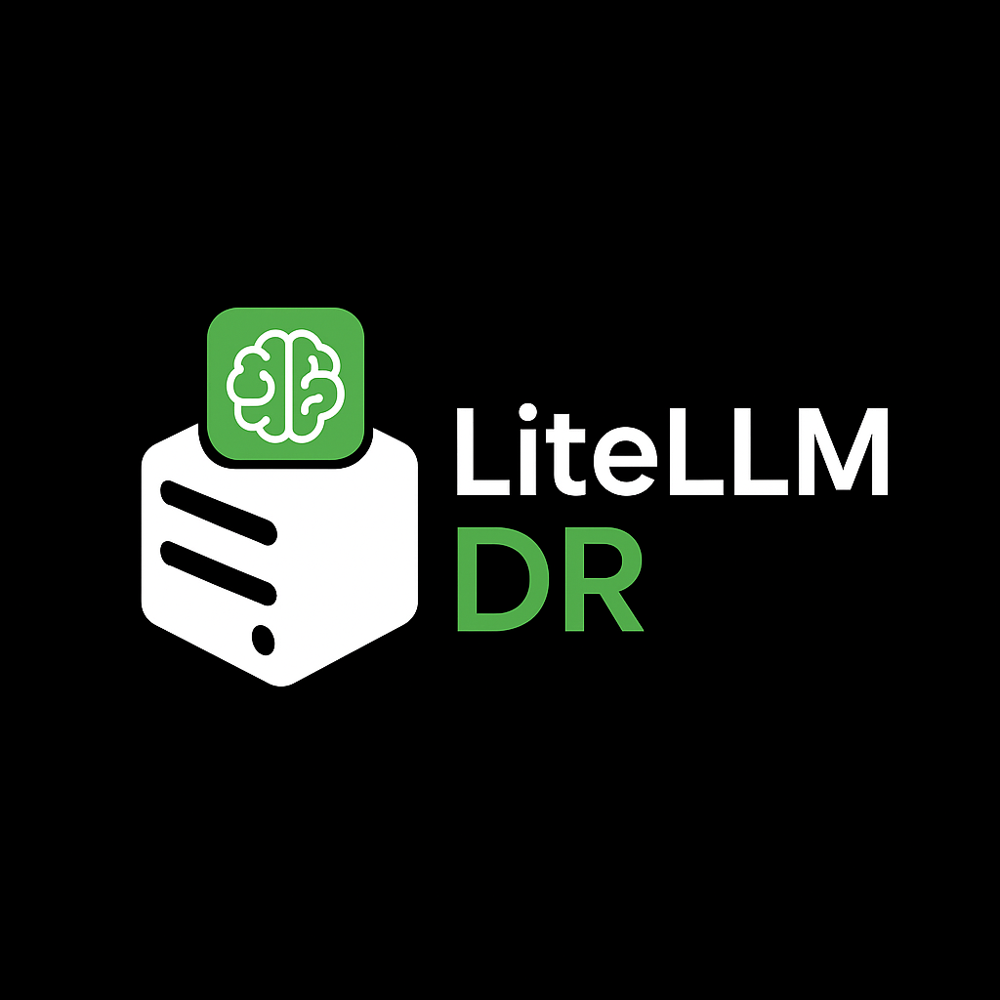

<div align="center">
  
</div>

# LiteLLM Deployment - DeepRunner.ai

Production-ready LiteLLM deployment with PostgreSQL, Ollama (Mistral), Nginx reverse proxy, and Microsoft 365 OAuth authentication.

## 🚀 Features

- **Multi-Provider Support**: OpenAI, Anthropic, Azure OpenAI, and local Ollama models
- **Local LLM**: Mistral model running on Ollama (no external API calls)
- **Secure Database**: PostgreSQL with encrypted data persistence
- **SSL/HTTPS**: Nginx reverse proxy with Let's Encrypt support
- **Microsoft 365 SSO**: Azure AD authentication for organization-wide access
- **Role-Based Access**: Admin, DevOps, and Team Member roles
- **Analytics Dashboard**: Custom 1-page dashboard for monitoring usage
- **High Performance**: CPU-optimized for production workloads
- **Auto-Scaling**: Load balancing and request queuing

## 📋 Quick Start

### Local Development

1. **Clone & Configure**
   ```bash
   git clone <repo-url>
   cd litellm-deeprunner
   cp .env.template .env
   nano .env  # Add your Microsoft OAuth credentials
   ```

2. **Start Services**
   ```bash
   docker compose up -d
   ```

3. **Access Locally**
   - **LiteLLM UI**: `http://localhost:3000/ui`
   - **API Docs**: `http://localhost:3000/`
   - **Database Admin (pgAdmin)**: `http://localhost:8081/browser/`
   - **Via Nginx**: `http://localhost:8080/ui` (with pgAdmin at `/pgadmin/`)

4. **Set Admin Role** (First time only)
   ```bash
   ./scripts/set-admin-role.sh
   ```
   Or manually update the database to set your user as `proxy_admin`.

### Production Deployment

1. **Prerequisites**
   - DigitalOcean Droplet (CPU-Optimized 4vCPU / 8GB RAM)
   - Domain Name (e.g., `prod.litellm.deeprunner.ai`)
   - Microsoft 365 Admin Access (for OAuth)

2. **Deploy**
   ```bash
   chmod +x scripts/setup.sh
   ./scripts/setup.sh
   ```

3. **Configure Azure AD**
   Add these redirect URIs in Azure Portal:
   - `http://localhost:3000/sso/callback` (local dev)
   - `https://prod.litellm.deeprunner.ai/sso/callback` (production)

4. **Update Environment on Production**
   ```bash
   scp .env docker-compose.yml config/ root@46.101.121.227:/path/to/litellm-deeprunner/
   ssh root@46.101.121.227
   cd /path/to/litellm-deeprunner
   docker compose down && docker compose up -d
   ./scripts/set-admin-role.sh
   ```

5. **Access Production**
   - **Admin UI**: `https://prod.litellm.deeprunner.ai/ui`
   - **Database Admin**: `https://prod.litellm.deeprunner.ai/pgadmin/`
   - **API Endpoint**: `https://prod.litellm.deeprunner.ai/v1`

## 🚀 Deployment Status

**Current Deployment**: Running on Production Droplet
- **Droplet**: 46.101.121.227 (Premium AMD 4GB/2CPU)
- **Status**: All services running, accessible at production URL
- **Access**: Sign-in page working
- **Next Step**: Configure Microsoft 365 OAuth authentication

See [TASKS.md](TASKS.md) for detailed progress tracking.

## 📁 Project Structure

```
litellm-deeprunner/
├── config/
│   ├── litellm-config.yaml    # LiteLLM configuration
│   ├── nginx.conf              # Nginx reverse proxy config
│   └── ssl/                    # SSL certificates
├── dashboard/
│   └── index.html              # Custom analytics dashboard
├── data/
│   ├── postgres/               # PostgreSQL data (persistent)
│   ├── ollama/                 # Ollama models (persistent)
│   └── pgadmin/                # pgAdmin data (persistent)
├── docs/
│   ├── DEPLOYMENT.md           # Complete deployment guide
│   └── M365_OAUTH_SETUP.md     # Microsoft 365 OAuth setup
├── scripts/
│   ├── setup.sh                # Automated deployment script
│   └── set-admin-role.sh       # Set user as admin in database
├── docker-compose.yml          # Service orchestration
├── .env.template               # Environment variables template
└── README.md                   # This file
```

## 🔧 Configuration

### Environment Variables

See `.env.template` for all configuration options including:
- Database credentials
- LiteLLM master key and salt
- Microsoft 365 OAuth (client ID, secret, tenant ID)
  - **Important**: Set both `MICROSOFT_TENANT_ID` and `MICROSOFT_TENANT`
- Admin email (for pgAdmin login)
- Domain configuration
- LLM provider API keys (OpenAI, Anthropic, Azure)

Generate secure keys: `openssl rand -hex 32`

### Database Administration

Access pgAdmin at:
- **Local**: `http://localhost:8081/browser/` (direct) or `http://localhost:8080/pgadmin/` (via Nginx)
- **Production**: `https://prod.litellm.deeprunner.ai/pgadmin/`

**Login credentials:**
- Email: Value from `ADMIN_EMAIL` in .env
- Password: Value from `UI_PASSWORD` in .env

**Database connection:**
- Host: `postgres`
- Port: `5432`
- Database: `litellm`
- Username: `litellm_user`
- Password: Value from `POSTGRES_PASSWORD` in .env

### Supported Models

**OpenAI:**
- gpt-4, gpt-4-turbo, gpt-3.5-turbo

**Anthropic:**
- claude-3-opus, claude-3-sonnet, claude-3-haiku

**Local (Ollama):**
- mistral-local

**Azure OpenAI:**
- Configure in `config/litellm-config.yaml`

## 🎯 API Usage

LiteLLM provides an OpenAI-compatible API at `https://litellm.deeprunner.ai/v1`

Use the OpenAI SDK (Python, JavaScript) or cURL with:
- **Endpoint**: `/v1/chat/completions`
- **Auth**: `Authorization: Bearer YOUR_MASTER_KEY`
- **Models**: Any configured model (gpt-4, claude-3-sonnet, mistral-local, etc.)

See [LiteLLM API docs](https://docs.litellm.ai/docs/proxy/user_keys) for complete API reference and examples.

## 🔐 Security Features

- **HTTPS Only**: SSL/TLS encryption via Let's Encrypt
- **Database Encryption**: PostgreSQL data at rest encryption
- **Network Isolation**: Ollama only accessible via LiteLLM
- **Firewall**: UFW with minimal open ports (22, 80, 443)
- **Fail2Ban**: Brute-force protection
- **OAuth**: Microsoft 365 SSO (no password management)
- **RBAC**: Role-based access control
- **Rate Limiting**: API request throttling
- **Audit Logs**: Complete request/response logging

## 📊 Role-Based Access Control

### Admin
- Full system access
- Manage API keys
- Configure models
- View all logs
- System settings

### DevOps
- Monitor performance
- View logs
- Create test API keys
- Access analytics

### Team Members
- Use API keys
- View personal usage
- Access models
- Limited admin functions

## 🛠️ Management Commands

### View Status
```bash
docker ps
docker-compose logs -f
```

### Restart Services
```bash
docker-compose restart
docker-compose restart litellm  # Specific service
```

### Update Services
```bash
docker-compose pull
docker-compose up -d
```

### Backup Database
```bash
docker exec litellm-postgres pg_dump -U litellm_user litellm > backup.sql
```

### View Resource Usage
```bash
docker stats
```

## 📖 Documentation

- **[Deployment Guide](docs/DEPLOYMENT.md)**: Complete setup instructions
- **[M365 OAuth Setup](docs/M365_OAUTH_SETUP.md)**: Azure AD configuration
- **[LiteLLM Docs](https://docs.litellm.ai)**: Official documentation
- **[Ollama Docs](https://ollama.ai/docs)**: Local model management

## 🔄 Maintenance

### Automated Backups
Database backups run daily at 2 AM (configured in setup script).

### SSL Renewal
Let's Encrypt certificates auto-renew on 1st and 15th of each month.

### Updates
```bash
cd ~/litellm-deeprunner
git pull  # If using git
docker-compose pull
docker-compose up -d
```

## 🐛 Troubleshooting

### Service Won't Start
```bash
docker-compose logs <service-name>
docker-compose restart <service-name>
```

### Can't Access Admin UI
1. Check SSL certificate: `openssl x509 -in config/ssl/fullchain.pem -text -noout`
2. Verify DNS: `dig litellm.deeprunner.ai`
3. Check firewall: `sudo ufw status`

### Ollama Model Issues
```bash
docker exec litellm-ollama ollama pull mistral
docker-compose restart ollama
```

### OAuth Login Fails
See [M365_OAUTH_SETUP.md](docs/M365_OAUTH_SETUP.md) troubleshooting section.

## 💰 Cost Estimate

### Infrastructure (DigitalOcean)
- Droplet: $84/month (CPU-Optimized 4vCPU/8GB)
- Bandwidth: Included (1TB)
- Backups: $8.40/month (optional)

### LLM Provider Costs
- OpenAI: Pay-as-you-go
- Anthropic: Pay-as-you-go
- Azure: Pay-as-you-go
- Ollama (Local): Free

**Total Infrastructure**: ~$84-92/month

## 📝 License

MIT License - See LICENSE file for details

## 🤝 Support

For issues or questions:
- Check documentation in `docs/`
- Review logs: `docker-compose logs`
- Contact: admin@deeprunner.ai

## 🙏 Credits

Built with:
- [LiteLLM](https://github.com/BerriAI/litellm) - OpenSource LLM proxy
- [Ollama](https://ollama.ai) - Run LLMs locally
- [PostgreSQL](https://postgresql.org) - Database
- [Nginx](https://nginx.org) - Reverse proxy
- [Docker](https://docker.com) - Containerization

---

**DeepRunner.ai** - Empowering teams with unified LLM access
